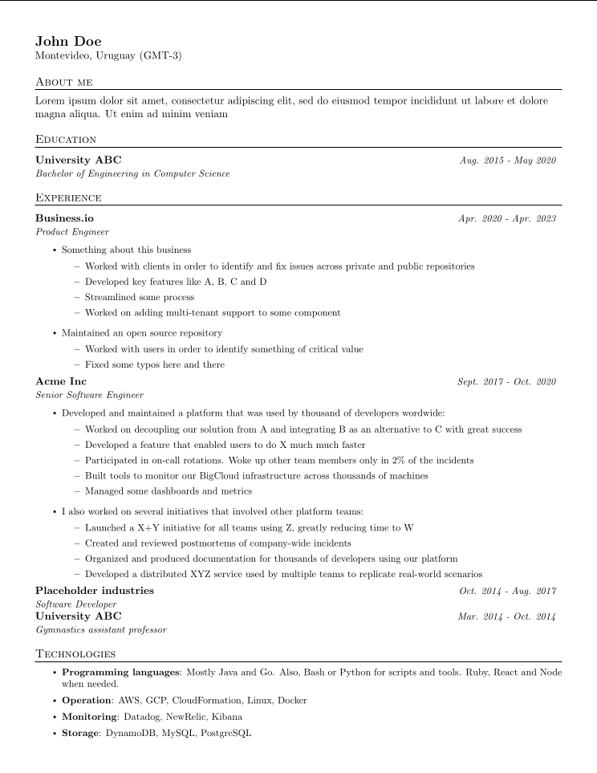

Basic repo that allows building a pdf resume using pdflatex running on an alpine container (no depedencies other than docker are needed for this template!).

### Build using docker
Running `make build && make run` outputs _resume.pdf_ using _resume.tex_ as input

Output format shown below.

